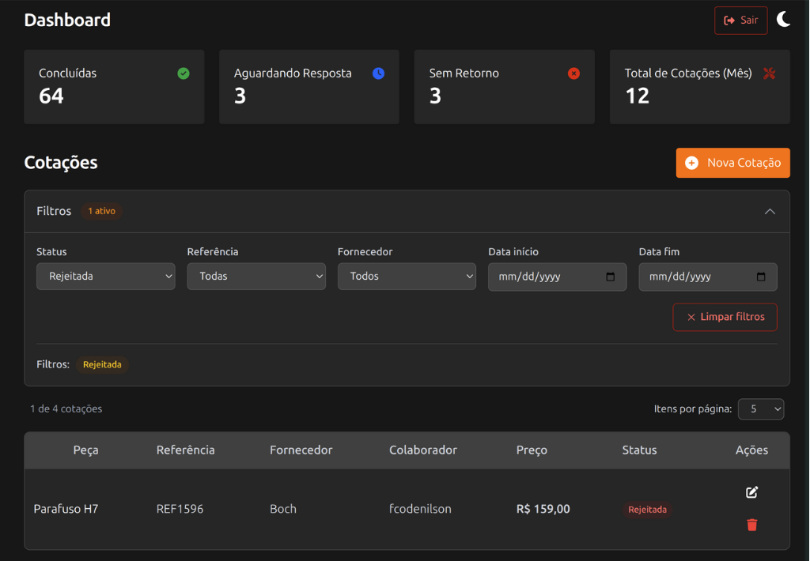
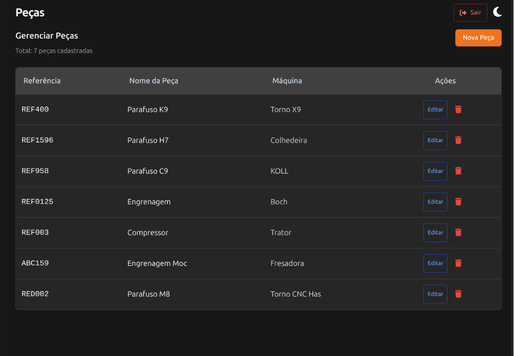
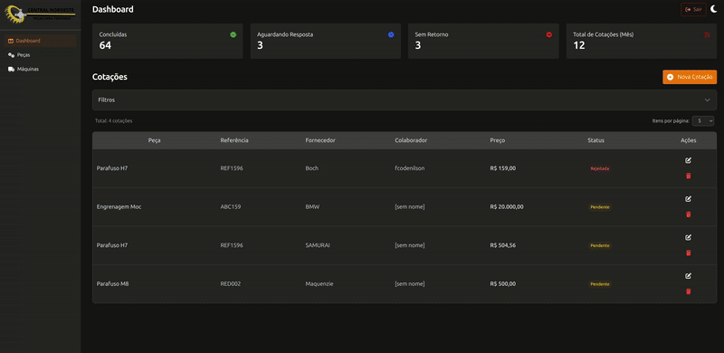
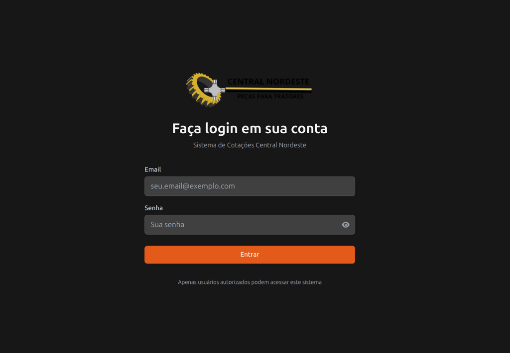

# 🏢 CN-Quotations - Sistema de Cotações Central Nordeste

Sistema moderno de gerenciamento de cotações para a Central Nordeste, desenvolvido com React, TypeScript e Firebase.


<!-- Placeholder: Adicione aqui uma imagem de banner da aplicação -->

## 📋 Índice

- [Sobre o Projeto](#sobre-o-projeto)
- [Funcionalidades](#funcionalidades)
- [Tecnologias](#tecnologias)
- [Pré-requisitos](#pré-requisitos)
- [Instalação](#instalação)
- [Configuração](#configuração)
- [Como Usar](#como-usar)
- [Screenshots](#screenshots)
- [Estrutura do Projeto](#estrutura-do-projeto)
- [Contribuindo](#contribuindo)
- [Licença](#licença)

## 🎯 Sobre o Projeto

O CN-Quotations é um sistema completo para gerenciamento de cotações industriais, desenvolvido especificamente para a Central Nordeste. O sistema permite o controle total de peças, fornecedores, cotações e status de orçamentos, oferecendo uma interface moderna e responsiva para uso em desktop e mobile.


<!-- Placeholder: Adicione aqui um GIF demonstrando o uso básico do sistema -->

## ✨ Funcionalidades

### 🔐 Autenticação e Segurança
- Sistema de login com Firebase Authentication
- Proteção de rotas privadas
- Logout seguro
- Feedback visual para operações de autenticação

### 📊 Dashboard
- Visão geral das cotações com cards informativos
- Métricas de cotações (Concluídas, Aguardando Resposta, Sem Retorno)
- Tabela responsiva com filtros avançados
- Paginação inteligente



### 🔧 Gerenciamento de Peças
- CRUD completo de peças
- Tabela responsiva com visualização desktop/mobile
- Formulários validados para criação e edição
- Sistema de referências únicas



### 📋 Sistema de Cotações
- Criação e edição de cotações
- Filtros por status, fornecedor, referência e data
- Badges de status coloridos (Aguardando, Concluída, Sem Retorno)
- Controle de preços com formatação BRL

### 🎨 Interface e UX
- Design responsivo (mobile-first)
- Modo claro e escuro
- Notificações toast para feedback do usuário
- Animações suaves e transições
- Sidebar colapsível


<!-- Placeholder: Adicione aqui um GIF mostrando a mudança de tema -->

## 🛠 Tecnologias

### Frontend
- **React 18** - Biblioteca principal
- **TypeScript** - Tipagem estática
- **Vite** - Build tool e dev server
- **React Router DOM** - Roteamento
- **Tailwind CSS** - Framework CSS utilitário

### Backend & Database
- **Firebase Authentication** - Sistema de autenticação
- **Firestore** - Banco de dados NoSQL
- **Firebase Hosting** - Deploy da aplicação

### Estado e Dados
- **TanStack Query (React Query)** - Gerenciamento de estado do servidor
- **React Context** - Estado global da aplicação

### UI/UX
- **React Hot Toast** - Notificações
- **FontAwesome** - Ícones
- **Responsive Design** - Suporte mobile

### Ferramentas de Desenvolvimento
- **ESLint** - Linting de código
- **TypeScript Compiler** - Verificação de tipos
- **Git** - Controle de versão

## 📋 Pré-requisitos

Antes de começar, certifique-se de ter instalado:

- **Node.js** (versão 18 ou superior)
- **npm** ou **yarn**
- **Git**
- Conta no **Firebase** (para configuração do backend)

## 🚀 Instalação

1. **Clone o repositório**
```bash
git clone https://github.com/codeNilson/cn-quotations.git
cd cn-quotations
```

2. **Instale as dependências**
```bash
npm install
```

3. **Configure as variáveis de ambiente**
```bash
cp .env.example .env.local
```

4. **Inicie o servidor de desenvolvimento**
```bash
npm run dev
```

A aplicação estará disponível em `http://localhost:5173`

## ⚙️ Configuração

### Firebase Setup

1. Crie um projeto no [Firebase Console](https://console.firebase.google.com)

2. Ative a **Authentication** e configure o provedor de email/senha

3. Crie um banco **Firestore Database**

4. Copie as configurações do Firebase para o arquivo `firebase.ts`:

```typescript
// firebase.ts
import { initializeApp } from 'firebase/app';
import { getAuth } from 'firebase/auth';
import { getFirestore } from 'firebase/firestore';

const firebaseConfig = {
  apiKey: "sua-api-key",
  authDomain: "seu-projeto.firebaseapp.com",
  projectId: "seu-projeto-id",
  storageBucket: "seu-projeto.appspot.com",
  messagingSenderId: "123456789",
  appId: "sua-app-id"
};

const app = initializeApp(firebaseConfig);
export const auth = getAuth(app);
export const db = getFirestore(app);
```

### Estrutura do Firestore

O banco de dados utiliza as seguintes coleções:

```
/quotations
  - id (string)
  - reference (string) // ID da peça
  - supplier (string)
  - price (number)
  - status (string)
  - createdAt (timestamp)
  - updatedAt (timestamp)
  - createdBy (string) // ID do usuário

/parts
  - id (string) // Número de referência
  - name (string)
  - machine_name (string)
  - createdAt (timestamp)
  - updatedAt (timestamp)
```

## 📱 Como Usar

### 1. Login


Acesse a aplicação e faça login com suas credenciais.

### 2. Dashboard

<!-- Placeholder: GIF mostrando navegação no dashboard -->

Visualize métricas importantes e navegue pelas cotações.

### 3. Gerenciar Peças

<!-- Placeholder: GIF mostrando CRUD de peças -->

- Adicione novas peças com referência, nome e máquina
- Edite peças existentes
- Exclua peças não utilizadas

### 4. Cotações

<!-- Placeholder: GIF mostrando uso de cotações -->

- Crie cotações vinculadas a peças
- Use filtros para encontrar cotações específicas
- Atualize status e preços

### 5. Mobile Experience

<!-- Placeholder: GIF mostrando responsividade mobile -->

A aplicação é totalmente responsiva e otimizada para mobile.

## 📁 Estrutura do Projeto

```
cn-quotations/
├── public/                 # Arquivos estáticos
│   └── logo.png
├── src/
│   ├── assets/            # Imagens e recursos
│   ├── components/        # Componentes React
│   │   ├── forms/         # Formulários
│   │   ├── Card.tsx
│   │   ├── Layout.tsx
│   │   ├── Sidebar.tsx
│   │   └── ...
│   ├── context/           # Context API
│   │   ├── AuthContext.tsx
│   │   ├── ThemeContext.tsx
│   │   └── ...
│   ├── hooks/             # Custom hooks
│   │   ├── useAuth.tsx
│   │   ├── useToast.tsx
│   │   └── ...
│   ├── models/            # Tipos TypeScript
│   │   ├── Part.tsx
│   │   ├── Quotation.tsx
│   │   └── User.tsx
│   ├── pages/             # Páginas da aplicação
│   │   ├── DashboardPage.tsx
│   │   ├── PartsPage.tsx
│   │   └── ...
│   ├── service/           # Serviços (Firebase)
│   │   ├── PartService.tsx
│   │   └── QuotationService.tsx
│   ├── types/             # Definições de tipos
│   ├── utils/             # Funções utilitárias
│   ├── main.tsx           # Ponto de entrada
│   └── style.css          # Estilos globais
├── firebase.ts            # Configuração Firebase
├── package.json
├── tailwind.config.js     # Configuração Tailwind
├── tsconfig.json          # Configuração TypeScript
└── vite.config.ts         # Configuração Vite
```

## 🎨 Temas e Customização


<!-- Placeholder: Screenshot mostrando opções de personalização -->

A aplicação suporta:
- **Modo Claro**: Interface limpa e profissional
- **Modo Escuro**: Redução de fadiga visual
- **Cores personalizáveis**: Através do Tailwind CSS
- **Componentes responsivos**: Adaptação automática

## 📊 Scripts Disponíveis

```bash
# Desenvolvimento
npm run dev          # Inicia servidor de desenvolvimento

# Build
npm run build        # Gera build de produção
npm run preview      # Preview do build

# Linting
npm run lint         # Executa ESLint

# Deploy
npm run deploy       # Deploy para Firebase Hosting
```

## 🤝 Contribuindo

Contribuições são sempre bem-vindas! Para contribuir:

1. Faça um fork do projeto
2. Crie uma branch para sua feature (`git checkout -b feature/AmazingFeature`)
3. Commit suas mudanças (`git commit -m 'Add some AmazingFeature'`)
4. Push para a branch (`git push origin feature/AmazingFeature`)
5. Abra um Pull Request

### Padrões de Código

- Use **TypeScript** para tipagem
- Siga os padrões do **ESLint**
- Componentes funcionais com **hooks**
- **Mobile-first** para responsividade
- **Conventional Commits** para mensagens

## 📈 Roadmap

### 🔄 Próximas Versões

- [ ] **Relatórios PDF** - Exportação de cotações
- [ ] **Dashboard Analytics** - Gráficos avançados
- [ ] **API Integration** - Integração com sistemas externos
- [ ] **Bulk Operations** - Operações em lote
- [ ] **User Roles** - Sistema de permissões
- [ ] **Email Notifications** - Notificações automáticas
- [ ] **Backup System** - Sistema de backup automático

### 🐛 Melhorias Conhecidas

- [ ] Otimização de performance para grandes datasets
- [ ] Implementação de PWA
- [ ] Suporte offline
- [ ] Testes automatizados

## 📝 Licença

Este projeto está licenciado sob a Licença MIT - veja o arquivo [LICENSE](LICENSE) para detalhes.

## 👨‍💻 Autor

**Denilson Silva**
- GitHub: [@codeNilson](https://github.com/codeNilson)
- LinkedIn: [Nilson Mendonça](https://linkedin.com/in/fcodenilson)
- Email: fcodenilson@gmail.com

---
